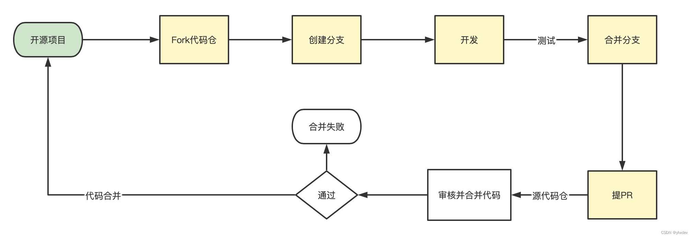
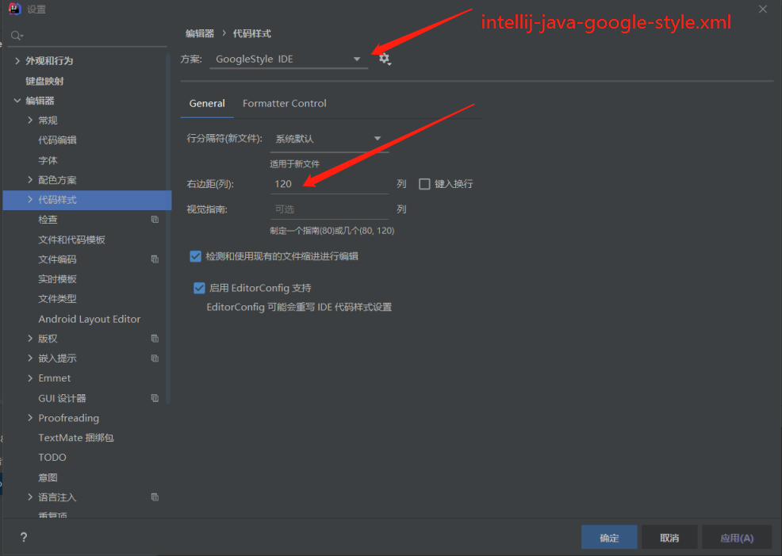
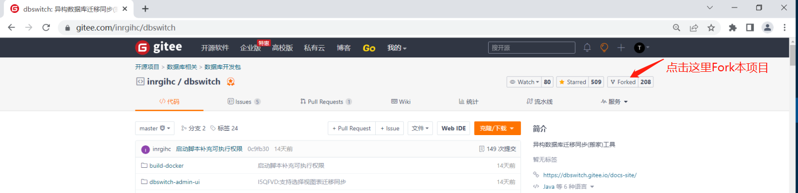
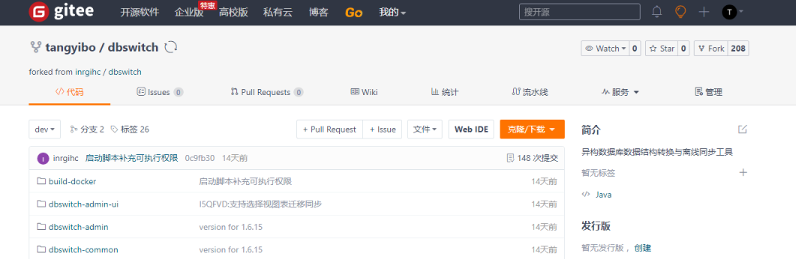
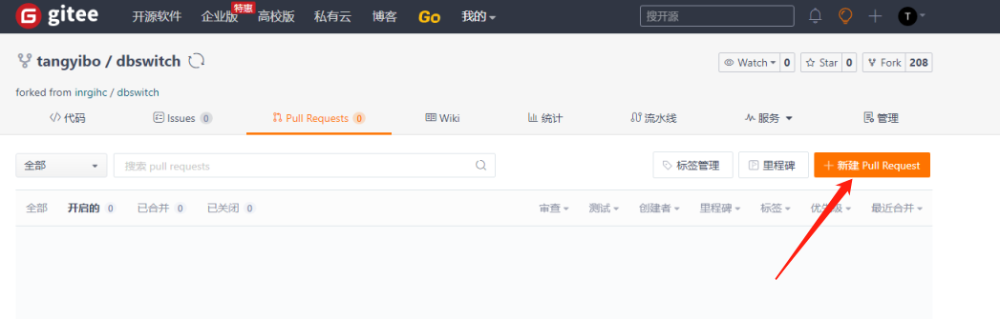
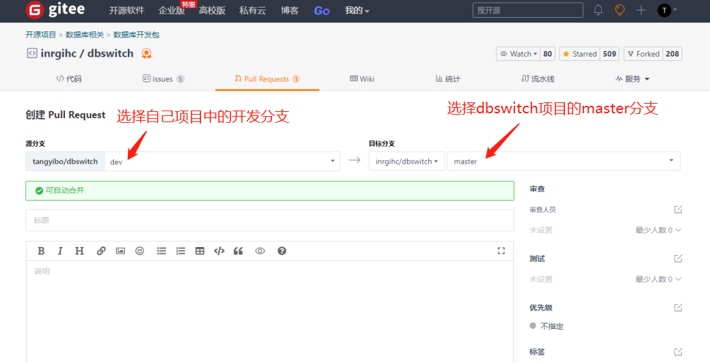

# 代码贡献指南

## 一、操作流程



## 二、开发规范

### 1、编码规范

请遵循阿里巴巴编码规范(Java)，IDEA推荐直接安装`Alibaba Java Coding Guidelines`
插件: https://plugins.jetbrains.com/plugin/10046-alibaba-java-coding-guidelines

### 2、代码格式

dbswitch使用java编码开发，这里以IDEA为例，指定使用google的代码风格，可将项目下的intellij-java-google-style.xml文件导入到IDEA中，也可到如下地址进行下载：

https://github.com/google/styleguide/blob/gh-pages/intellij-java-google-style.xml



## 二、操作步骤

### 1、Fork 本项目

首先使用gitee账号（如果没有请先注册）登陆后，然后进入地址```https://gitee.com/inrgihc/dbswitch```中，点击```fork```按钮，在自己账号下复制一份dbswitch项目，如下图：



### 2、Clone 自己的项目

- (1) 拉取远端的代码到本地

```
git clone -b master https://gitee.com/tangyibo/dbswitch.git
cd dbswitch/
git checkout -b dev
```

**注：请替换上述中的tangyibo为您gitee的实际账号信息**

- (2) 请正确配置自己的信息(此信息会包含在后面的commit提交信息中)

```
git config --local user.name xxxx
git config --local user.email xxxx@126.com
```

**注：请替换上述中的xxxx为实际的信息**

- (3) 配置远端dbswitch项目的名称(这里假设为upstream)

```
git remote add upstream https://gitee.com/inrgihc/dbswitch.git
```

### 2、commit & push到自己的分支

- (1) 在本地向自己的分支中提交代码:

- (2) fetch 远端dbswitch的最新代码

```
git fetch upstream master
```

- (3) rebase 远端dbswitch的最新代码(处理可能存在的冲突)

```
git rebase upstream/master
```

- (4) push 本地代码到远端

```
git push
```

- (5) 查看远端的commit信息

  

### 3、创建 pull requests

在自己的分支上创建pull requests:



选择对应的分支：



填写好“标题”和“描述”，点击“创建Pull Request"即可完成代码提交合入申请操作，审核通过后您成为dbswitch项目贡献者。
